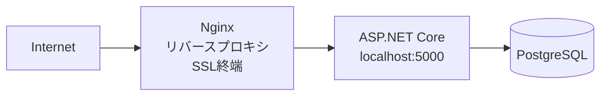

# QRQueue

近畿大学マイコン部が作成した抽選システム

## 構成

- **QRQueue** - ASP.NET Core Web アプリ（バックエンド + JsxCore による TSX ビュー）
- **QRQueue.Aspire** - .NET Aspire開発環境オーケストレーション

## ディレクトリ構造

```
QRQueue/
├── .github/
│   └── workflows/
│       └── deploy.yml              # Webアプリデプロイ
├── .deploy/
│   └── qrqueue.service        # systemdサービス定義
├── QRQueue/            # バックエンド
│   ├── Controllers/                # APIコントローラー
│   ├── Models/                     # データモデル
│   ├── Services/                   # ビジネスロジック
│   ├── Hubs/                       # SignalRハブ
│   ├── Migrations/                 # DBマイグレーション
│   ├── Views/                      # フロントエンド (JsxCore / TSX)
│   └── appsettings.json
├── QRQueue.Aspire/     # 開発環境オーケストレーション
│   ├── QRQueue.Aspire.AppHost/
│   └── QRQueue.Aspire.ServiceDefaults/
└── QRQueue.sln
```

## 技術スタック

### バックエンド
- .NET 10.0
- ASP.NET Core
- Entity Framework Core
- PostgreSQL

### フロントエンド
- JsxCore（TSX ビューエンジン、Node.js 不要）

### 開発環境（.NET Aspire）
- .NET Aspire 9.5

## 開発環境

### 前提ソフトウェア

| ソフトウェア | バージョン | 備考 |
|-------------|-----------|------|
| [.NET SDK](https://dotnet.microsoft.com/download) | 10.0 | `dotnet --version`で確認 |
| [Docker Desktop](https://www.docker.com/products/docker-desktop) | 最新 | Aspire用コンテナ実行環境 |
| [Git](https://git-scm.com/) | 最新 | `git --version`で確認 |

### インストール確認

```bash
dotnet --version    # 10.0.x
docker --version    # Docker version ...
git --version       # git version ...
```

### セットアップ

```bash
# リポジトリをクローン
git clone https://github.com/kindai-micon/QRQueue.git
cd QRQueue

# .NETの依存関係を復元（JsxCore の依存もビルド時に自動復元）
dotnet restore

# Aspire AppHostを実行（PostgreSQL含む）
dotnet run --project QRQueue.Aspire/QRQueue.Aspire.AppHost
```

Aspireダッシュボードが自動的に開き、各サービスの状態を確認できます。

## 設定ファイル

### Webアプリ（appsettings.json）

`QRQueue/appsettings.json`:

```json
{
  "ConnectionStrings": {
    "lottery-db": "Host=localhost;Database=lottery;Port=5432;Username=postgres;Password=your_password"
  },
  "LotteryBaseUrl": "http://localhost:5000",
  "UseHttpsForQrCode": false,
  "Cors": {
    "AllowedOrigins": ["http://localhost:5000"]
  }
}
```

| 設定項目 | 説明 |
|---------|------|
| `ConnectionStrings:lottery-db` | PostgreSQL接続文字列 |
| `LotteryBaseUrl` | 抽選画面のベースURL |
| `UseHttpsForQrCode` | QRコードURLでHTTPSを使用するか |
| `Cors:AllowedOrigins` | CORS許可オリジン |

## データベース構築

### PostgreSQLのセットアップ

```bash
# PostgreSQLに接続
sudo -u postgres psql

# データベース作成
CREATE DATABASE my_db;

# ユーザー作成
CREATE USER postgres WITH PASSWORD 'your_password';
GRANT ALL PRIVILEGES ON DATABASE my_db TO postgres;
```

### マイグレーション

```bash
# マイグレーションの作成
dotnet ef migrations add InitialCreate --project QRQueue

# データベースに適用
dotnet ef database update --project QRQueue
```

## 本番環境

### 構成



- **Webサーバー**: Nginx（リバースプロキシ、SSL終端）
- **アプリケーションサーバー**: ASP.NET Core (systemd)
- **データベース**: PostgreSQL
- **SSL証明書**: Let's Encrypt (Certbot)
- **デプロイ先**: `/var/www/qrqueue/publish`
- **URL**: https://lottery.kindai-micon.club

### デプロイフロー

1. `release`ブランチにマージ
2. GitHub Actionsが自動的にビルド・デプロイ
3. systemdサービスが再起動

### サービス管理

#### systemdサービス定義

`.deploy/qrqueue.service`:

```ini
[Unit]
Description=QRQueue
After=network.target

[Service]
WorkingDirectory=/var/www/qrqueue/publish
ExecStart=/usr/bin/dotnet /var/www/qrqueue/publish/QRQueue.dll
Restart=always
Environment=ASPNETCORE_ENVIRONMENT=Production
Environment=ASPNETCORE_URLS=http://*:5000

[Install]
WantedBy=multi-user.target
```

#### 管理コマンド

```bash
# アプリケーションサービス
sudo systemctl status qrqueue    # 状態確認
sudo systemctl restart qrqueue   # 再起動
sudo journalctl -u qrqueue -f    # ログ確認

# Nginx
sudo systemctl status nginx           # 状態確認
sudo nginx -t                         # 設定テスト
sudo systemctl reload nginx           # 設定再読み込み

# SSL証明書更新
sudo certbot renew                    # 証明書更新
```

## デプロイ

### Webアプリ
`release`ブランチにマージすると自動的にデプロイされます。

## ライセンス

[MIT License](LICENSE.txt)
