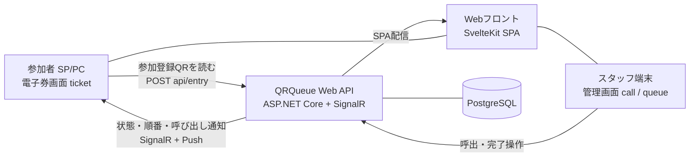
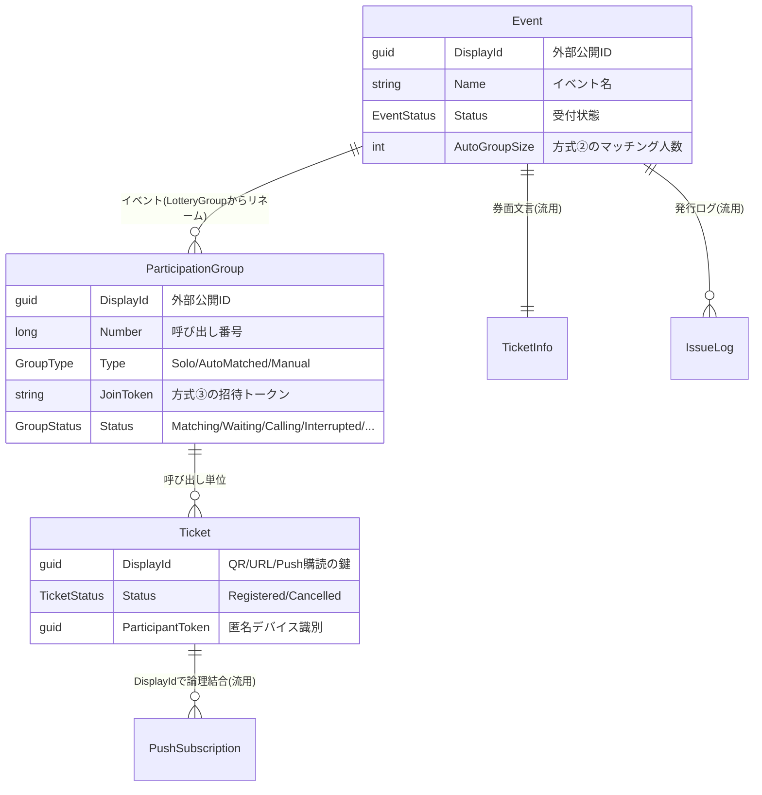
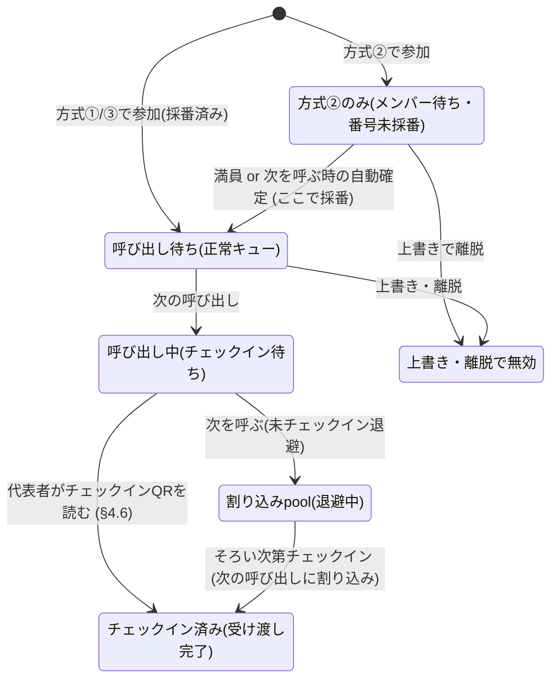
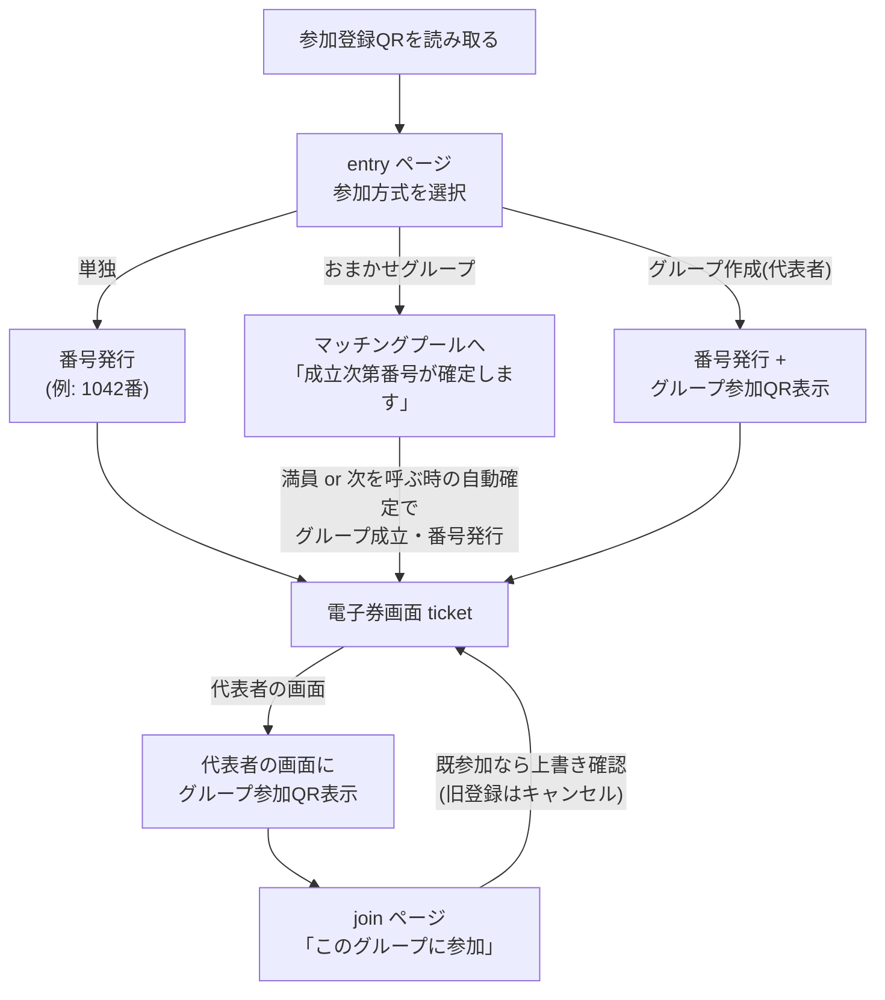

# 先着順呼び出しシステム 改造設計書

| 項目 | 内容 |
|---|---|
| 対象システム | QRQueue(旧: 抽選システム) |
| 文書ステータス | ドラフト v1 |
| 作成日 | 2026-08-15 |
| 前提 | 既存実装(抽選システム)からの改造。抽選機能は削除し先着順方式へ完全置換 |

---

## 1. 目的・背景

既存 QRQueue は「QR付き整理券を配布 → スタッフがactivate → 抽選 → 当選者引換」というフローの抽選システムである。
今回、**参加順 = 呼び出し順**となる先着順呼び出しシステムへ改造する。あわせて、参加登録の主体を「スタッフによる紙チケットの読み取り」から「**参加者自身がQRコードを読んでセルフ登録**」へ変更する。

**チケットは電子券とし、紙の発行は一切行わない。** 参加登録を完ねた参加者には Web上の電子券画面(`/ticket/{displayId}`)が発行され、これが唯一の参加証となる(呼び出し番号の確認・グループ参加QRの表示・Push通知の受け取りもすべてこの画面で行う)。

### 1.1 要求まとめ

- 呼び出しは**先着順**(参加登録順)。
- 参加方式は3種類:
  1. **単独参加**(1人)
  2. **システム側グループ化参加**(単独参加者を参加順で自動的にグループ化)
  3. **手動グループ参加**(2〜3人。代表者が参加登録後、代表者のグループ参加QRで他のメンバーも登録。メンバー登録は任意)
- 参加登録は**参加者がQRコードを読み込む**ことで行う。
- **単独参加済みの参加者が後からグループ参加した場合、単独登録は上書き(キャンセル)される。**
- グループ人数上限は**代表者含め3人**。
- チケットは**電子券のみ**(紙発行・印刷なし)。

---

## 2. 用語定義

| 用語 | 定義 |
|---|---|
| イベント (Event) | 参加登録から呼び出し完了までを1セットで管理する単位(例: ある企画の1日の受付)。旧「抽選会」。既存 `LotteryGroup` を **`Event` にリネーム** して使用 |
| 参加者 (Participant) | QRを読んで参加登録した個人。匿名(アカウント不要) |
| チケット (Ticket) | 参加者1人に1枚発行される**電子券**。紙の発行はなく、参加者画面(`/ticket/{displayId}`)が券面。既存 `Ticket` を流用 |
| グループ (Group) | 呼び出しの最小単位。単独参加も内部的には1人グループ |
| 呼び出し番号 | グループ単位で採番される番号。参加者画面に表示 |
| 参加登録QR | イベント単位で発行される固定URLのQR。会場に掲示し全参加者が読む |
| グループ参加QR | 手動グループの代表者だけが表示できる招待QR。`joinToken` を含む |

---

## 3. システム全体像



既存アーキテクチャ(Web API + SvelteKit SPA + Avaloniaデスクトップ + PostgreSQL + SignalR)はそのまま活用し、**ドメインロジック(抽選→先着順)と参加登録フローを置換**する。

---

## 4. 参加方式の詳細仕様

### 4.1 方式① 単独参加

- 参加者がイベントの参加登録QR `{base}/entry/{eventDisplayId}` を読む。
- 登録画面で「単独で参加」を選択。
- **1人グループ**として即座に呼び出しキューへ登録され、呼び出し番号を採番。

### 4.2 方式② システム側グループ化参加(参加順マッチング)

- 登録画面で「グループに相乗りしたい(システムにおまかせ)」を選択した単独参加者は、**マッチングプール**に入る。
- グループ成立のタイミングは2つ:
  1. **満員成立**: プールへの参加順に並び、設定人数(デフォルト3人、設定可能)が揃った時点で即座にグループを成立させ、呼び出しキュー末尾へ登録・番号採番する。
  2. **自動確定**: 呼び出し待ち・割り込みpoolが空で呼び出せるグループがなくなった時点で、プールに残っている人数(1〜2人)で別グループを成立させる。人が集まっていなければ集まった分だけで別グループを作る形(発火タイミングは§4.6の「次を呼ぶ」)。
- グループ成立順 = **成立順**をキュー順とする(後述の採番規則参照)。
- 方式②の参加者が方式③のグループ参加QRで参加した場合、プールから取り除かれグループへ移動(上書き)。

### 4.3 方式③ 手動グループ参加(2〜3人)

- **代表者**が参加登録QRを読み、「グループを作って参加」を選択。
  - グループが作成され、代表者のチケットが発行される。
  - **この時点で**グループは呼び出しキューへ登録され番号を採番する(メンバーが揃うのを待たない)。
  - 代表者の参加者画面(`/ticket/{displayId}`)に**グループ参加QR**(`{base}/join/{joinToken}`)が表示される。
- **メンバー**は代表者の画面のQRを読むと `{base}/join/{joinToken}` に遷移し、「このグループに参加」を押すことで自身のチケットが発行されグループへ追加される。
  - メンバー登録は**任意**(0人でもグループは成立している)。
  - 上限は**代表者含め3人**。4人目の参加はエラー(既に満員)。
- メンバー参加でグループの呼び出し番号・キュー順は**変化しない**。

### 4.4 上書きルール

| 状況 | 動作 |
|---|---|
| 方式①(単独確定済み)の参加者が③の招待QRで参加 | 元の単独グループをキャンセル(Cancelled)。チケットは新グループへ付け替え。呼び出し順は新グループ(代表者登録時点)になる |
| 方式②(マッチング待ち)の参加者が③の招待QRで参加 | マッチングプールから取り除き新グループへ |
| 方式③のメンバー/代表者が改めて単独(①)で参加 | そのグループから離脱し単独グループとして新規参加。グループ参加QRは代表者の画面依存のため、**代表者が離脱した場合そのグループのメンバー追加受付は終了(joinToken無効化)**。残メンバーの登録は維持 |
| 呼び出し済み(Calling以降)のグループへの参加・離脱 | 不可(エラー) |

> 上書き時、参加者が持っているQR/URL(チケットの `DisplayId`)は変わらないよう、**チケットの付け替え**で実装する。Web Push購読も `DisplayId` ベースのため引き継がれる。

### 4.5 採番規則(先着順の定義)

- 呼び出し番号は**グループが呼び出しキューに載った順**にイベント内で一意の連番を採番する。
  - 方式①: 参加登録時
  - 方式③: 代表者登録時(メンバー追加では採番しない)
  - 方式②: グループ成立時(満員成立、または§4.6「次を呼ぶ」による自動確定)
- 番号採番は既存 `TicketIssuanceService` と同じく **`Serializable` 分離レベルのトランザクション**内で `MAX(Number)+1` 方式で行い、同時登録の競合を防ぐ。
- 開始番号は既存踏襲で **1000番から**。

### 4.6 呼び出しフェーズ(チェックイン駆動)

呼び出し〜受け渡しは、**参加者側の「チェックイン」で駆動する**。スタッフの操作は基本的に「次を呼ぶ」だけ。

**QR**:**チェックインQR**(`{base}/checkin/{eventDisplayId}`)を受付に掲示しておく(参加登録QRとは別のQR)。

**チェックイン(受付の確定)**:

- 呼び出し中(Calling)のグループは、**メンバーが受付に実際にそろった時点で、代表者が自分のスマホでチェックインQRを読み込む**ことで「参加した(受け付けた)」ものと確定し、グループは完了(Completed)になる。
  - 「そろったか」の判定は代表者の自己判断(代表者が読み込む行為が確定操作)。**そろっていなければ読み込まれないので、グループは呼び出し中ステータスのまま**何も起きない。
  - 代表者 = 方式③はグループ作成者、方式①は本人、方式②は参加順先頭。
- チェックインQRの読み取りは参加者端末の **署名付きcookie(`participantToken`)** で本人特定する(スタッフが参加者の電子券QRをスキャンする逆向きはしない)。
- 正常キューから呼び出されていたグループのチェックイン完了をトリガーに、**次の呼び出しが自動で走る**(AutoNext)。

**「次を呼ぶ」と割り込みpool**:

- スタッフが「次を呼ぶ」を押したとき、**現在呼び出し中で未チェックインのグループがあれば、そのグループを割り込みpool(退避)へ移す**。
- 割り込みpoolに入ったグループは、後ほど**メンバーがそろい次第、代表者がチェックインQRを読み込むことで、その次の呼び出しに割り込んで**完了扱いになる(正常キューを待たずに処理される)。
- 「次を呼ぶ」の呼び出し先の優先順位:
  1. チェックイン済みでまだ処理されていない割り込みグループ(実質即完了)
  2. 正常キュー(Waiting)の先頭
  3. どちらも空なら、方式②のプールに残りメンバーがいれば自動確定して呼び出す(§4.2)
  4. すべて空なら「呼び出せるグループなし」

---

## 5. データモデル設計

### 5.1 ER図



> `ParticipantToken`(匿名デバイス識別)は Ticket カラムに埋め込み。`LotterySlots` は削除。

### 5.2 エンティティ定義

#### `Event`(旧 `LotteryGroup` からリネーム)

既存 `LotteryGroup` を `Event` にリネームし、抽選関連のナビゲーション(`LotterySlots`)を削除する。

```csharp
public class Event : BaseModel   // LotteryGroup をリネーム
{
    public Guid DisplayId { get; set; } = Guid.CreateVersion7();
    public string Name { get; set; }
    public List<ParticipationGroup> Groups { get; set; } = new();
    // 新規カラム(イベント運用状態)
    public EventStatus Status { get; set; } = EventStatus.Preparing; // 受付前/受付中/受付終了
    public int AutoGroupSize { get; set; } = 3;   // 方式②のマッチング人数(上限3)
    [ForeignKey(nameof(TicketInfo))]
    public Guid TicketInfoId { get; set; }
    public TicketInfo TicketInfo { get; set; }
}
public enum EventStatus { Preparing, Open, Closed }
```

> リネームは本改造に含める(クラス・DbSet・テーブル・API ルート・フロントのルート・画面文言を一括で `Event`/`イベント` に統一)。「抽選」を想起させる名称を残さない。

#### `ParticipationGroup`(新設 — 呼び出しの最小単位)

```csharp
public class ParticipationGroup : BaseModel
{
    public Guid DisplayId { get; set; } = Guid.CreateVersion7();
    public long Number { get; set; }                  // 呼び出し番号(キュー載せ時に採番、未採番=0/null)
    [ForeignKey(nameof(Event))]
    public Guid EventId { get; set; }                 // 所属イベント(LotteryGroupId から変更)
    public GroupType Type { get; set; }
    public string? JoinToken { get; set; }            // 方式③のみ。UUID v7のランダム文字列
    public GroupStatus Status { get; set; } = GroupStatus.Waiting;
    public DateTimeOffset? CalledAt { get; set; }     // 最後の呼び出し時刻
    public int CallCount { get; set; } = 0;           // 再呼び出し回数
    public List<Ticket> Tickets { get; set; } = new();
    [NotMapped] public bool IsFull => Tickets.Count(t => t.Status != TicketStatus.Cancelled) >= 3;
}
public enum GroupType
{
    Solo,        // 方式①: 1人固定
    AutoMatched, // 方式②: システム側マッチング
    Manual,      // 方式③: 代表者による手動グループ
}
public enum GroupStatus
{
    Matching,    // 方式②: プール内でメンバー待ち(キュー外・番号未採番)
    Waiting,     // 呼び出し待ち(正常キュー内)
    Calling,     // 呼び出し中(チェックイン待ち)
    Interrupted, // 割り込みpool: 「次を呼ぶ」で未チェックインのまま退避された(§4.6)
    Completed,   // チェックイン済み(受け渡し完了)
    Cancelled,   // 上書き・キャンセルにより無効
}
```

#### `Ticket`(流用 + カラム変更)

```csharp
public class Ticket : BaseModel        // 既存流用
{
    public long Number { get; set; }   // 廃止予定: 呼び出し番号は ParticipationGroup.Number へ移行
    public Guid DisplayId { get; set; }// 変更なし。QR/URL/Push購読の鍵
    [ForeignKey(nameof(ParticipationGroup))]
    public Guid ParticipationGroupId { get; set; }   // 新設FK(旧 LotteryGroupId/LotterySlotsId は削除)
    public ParticipationGroup ParticipationGroup { get; set; }
    public TicketStatus Status { get; set; }
    public Guid? ParticipantToken { get; set; }      // 新設: 匿名デバイス識別(重複登録検知)
}
public enum TicketStatus   // 置換
{
    Registered,  // 参加登録済み
    Cancelled,   // 上書き・離脱により無効
}
```

- チケットのライフサイクル状態(呼び出し中/完了)は**グループ**で管理する。チケット側は「登録済み/キャンセル」のみ。
- `ParticipantToken` は参加登録APIが発行するランダムUUID(`Guid.CreateVersion7`)。**localStorage ではなく HttpOnly の署名付きcookie(§5.2.1)** に保存する。同じ端末からの再アクセスでは既存チケットを返して二重参加を防ぐ。

#### 5.2.1 participantToken cookie(署名付き)

参加者の端末識別は localStorage ではなく **HttpOnly cookie + ASP.NET Core の Data Protection 署名**で行う。

| 項目 | 設定 |
|---|---|
| cookie 名 | `participant` |
| 値 | 署名・暗号化された認証チケット。claim `participantToken`(= DB の `Ticket.ParticipantToken` と同じUUID)を含む |
| 属性 | `HttpOnly; Secure; SameSite=Lax; Path=/`(永続 cookie、有効期限90日) |
| 発行 | 初回の `POST /api/entry/join` 成功時(参加登録QRを初めて読んだ端末で確定) |
| 更新 | 上書き再参加・グループ参加でも**端末単位で不変**。発行は1回きり |

実装は管理ユーザーの Identity cookie と同じ `AddCookie` インフラを**別スキーム**で追加する(既定スキームは Identity のまま):

```csharp
builder.Services.AddAuthentication()
    .AddCookie("Participant", options =>
    {
        options.Cookie.Name = "participant";
        options.Cookie.HttpOnly = true;
        options.Cookie.SecurePolicy = CookieSecurePolicy.Always;
        options.Cookie.SameSite = SameSiteMode.Lax;
        options.ExpireTimeSpan = TimeSpan.FromDays(90);
        options.SlidingExpiration = false;
        // participantToken claim ⇔ DB 照合(失効済みトークンなら拒否)
        options.Events.OnValidatePrincipal = async context =>
        {
            /* Ticket.ParticipantGroup の状態と突き合わせて reject */
        };
    });
```

- 参加登録成功時に `SignInAsync("Participant", principal, isPersistent: true)` で発行。**Data Protection の署名・暗号化により改ざん・偽造・JS からの読み取りが不可能**(鍵は管理cookieと同じキーリング)。
- 各参加APIは body の `participantToken` を廃止し、`User.FindFirstValue("participantToken")` で取得する。cookie がない/無効な場合は未参加として扱う。
- `SameSite=Lax` により、チェックインQR(自サイトURL)への遷移では送られるが**他サイトからの POST には付かない**ため、チェックインAPIの CSRF も構造的に防ぐ。
- cookie はリクエストに自動添付されるため、`GET /entry/{eventDisplayId}` を**サーバー側で復元判定して 302 リダイレクト**できる(SSR で完結し、JS による画面遷移よりちらつかない)。

> `DisplayId`(電子券URLの鍵)は引き続き URL のみに載せる。cookie に入れる参加者識別は `participantToken` のみ。

#### 削除・廃止

| 対象 | 理由 |
|---|---|
| `LotterySlots` / `SlotStatus` / `NumberOfFrames` / `DeadLine` / `Order` | 抽選枠の概念そのものが不要 |
| `Ticket.LotteryGroupId` / `LotterySlotsId` | `ParticipationGroupId` に集約 |
| `TicketStatus.Invalid / PrintPublishing / Valid / Winner / Exchanged` | 新状態機械へ置換 |
| `TicketInfo.BaseUrl`(未使用のtypo入り定数) | この機会に削除 |

### 5.3 状態機械

**ParticipationGroup.Status:**



---

## 6. API設計

### 6.1 参加者向け(匿名・認証なし)

新しい `EntryController`(`api/entry`)を作る。

| エンドポイント | リクエスト | レスポンス / 動作 |
|---|---|---|
| `GET /api/entry/{eventDisplayId}` | — | イベント名・受付状態(Openか)・グループ上限。参加登録画面の初期化 |
| `POST /api/entry/join` | `{ eventDisplayId, mode: "solo" \| "pool" \| "group-create", overwrite?: bool }` | `{ ticketDisplayId, groupNumber?, joinToken? }`。solo=即キュー+採番 / pool=マッチングプールへ / group-create=グループ作成+代表者登録+採番。**参加者cookie**が既存の有効な参加に一致する場合は 409(クライアントは `overwrite: true` を付けて再送、または既存券を復元)。新規参加の場合はこのレスポンスで参加者cookie(§5.2.1)を発行 |
| `POST /api/entry/restore` | `{ eventDisplayId }` | `{ ticketDisplayId }`。同一端末からイベントページを再び開いた際、**参加者cookie**で**電子券を復元**して `/ticket/{displayId}` へ遷移(電子券は紙がないためURL喪失対策が必須)。cookieがない/該当なしは 404 |
| `POST /api/entry/checkin` | `{ eventDisplayId }` | チェックインQRの飛び先が呼ぶAPI(§4.6)。**参加者cookie**で特定した参加者の属するグループが `Calling` なら **Completed に確定(受付完了)** し、AutoNext(次の呼び出し)を発火。`Interrupted` なら同様に完了し、**次の呼び出しに割り込んで**処理対象にする。`Waiting`/`Matching` なら 409「まだ呼び出されていません」。**参加者がグループの代表者でない場合も 409「代表者のスマホから読み取ってください」**。そろっていない場合に読み取られない限り、グループは `Calling` のまま何も変化しない |
| `GET /api/entry/group/{joinToken}` | — | `{ groupNumber, memberCount, isFull, isJoinable }`。メンバー参加確認画面用 |
| `POST /api/entry/group/join` | `{ joinToken }` | `{ ticketDisplayId, groupNumber }`。既にどこかに参加済み(参加者cookieで判定)なら上書き(旧グループ離脱/Cancelled)処理を行う。満員・joinToken無効・呼び出し済みは 409 |
| `GET /api/ticket/{guid}` | — | 既存流用。レスポンスを `{ eventDisplayId, eventName, groupNumber, status, currentCallingNumber, aheadCount }` へ拡張 |
| `POST /api/push-subscription/{guid}` | — | 既存流用。呼び出し通知に転用 |

### 6.2 管理向け(認証 + Policy)

新しい `CallController`(`api/call`)。既存の動的権限(`DynamicRoleHandler`)仕組みはそのまま使う。

| エンドポイント | Policy(新設) | 動作 |
|---|---|---|
| `PUT /api/call/open/{eventDisplayId}` | `EventOpenClose` | 受付開始(EventStatus=Open) |
| `PUT /api/call/close/{eventDisplayId}` | `EventOpenClose` | 受付終了(Closed)。以後の join は 409 |
| `PUT /api/call/next/{eventDisplayId}` | `CallExecute` | 「次を呼ぶ」(§4.6)。①現在 Calling で未チェックインのグループがあれば **Interrupted(割り込みpool)へ退避** → ②呼び出し先を優先順位どおり決定(チェックイン済み割込みGr → Waiting先頭 → 方式②プール自動確定)→ Calling へ。呼び出せるグループがなければ 204。SignalR + Push 通知 |
| `PUT /api/call/again/{eventDisplayId}` | `CallExecute` | 再呼び出し。現在 Calling のグループの `CallCount++` と表示再強調(Push 再送) |
| `GET /api/call/queue/{eventDisplayId}` | `CallView` | 呼び出し待ち一覧(番号・人数・状態)・現在呼び出し中・割り込みpool・プール人数。管理/表示画面用 |

権限は `AuthorityScanService` の自動スキャンに乗るため、`[Authorize(Policy="...")]` 属性を付けるだけでDB駆動の権限管理に自動登録される(既存の仕組みをそのまま利用)。

### 6.3 流用・削除

| 既存コントローラ | 扱い |
|---|---|
| `TicketController` | `GET /api/ticket/{guid}` は拡張して流用。activate/deactivate/Exchange は削除 |
| `LotteryExecuteController` | **削除**(CallController が置換) |
| `LotterySlotController` | **削除** |
| `LotteryGroupController` | **`EventController`(`api/event`)にリネーム**して流用(イベント CRUD) |
| `TicketPdfController` | **参加登録QRの掲示用PDF発行**に転用(イベント単位で1QRを含むA4掲示物を出力) |
| `ReceiptController` / `DesktopAuthController` | **削除**(レシートプリンタ運用は行わない) |
| `AdminController.DeleteAllData` | 流用(抽選データの破棄に使用) |

---

## 7. SignalR 設計

`LotteryHub` を **`QueueHub`(`/api/queueHub`)にリネーム**して流用する(接続をイベント `DisplayId` 単位のグループへ登録。Hub メソッド `SetLotteryGroup`/`RemoveLotteryGroup` も `SetEvent`/`RemoveEvent` へリネーム)。

| イベント(サーバ→クライアント) | 送信タイミング | ペイロード | 用途 |
|---|---|---|---|
| `UpdateStatus`(流用) | 参加登録・上書き・キャンセル | "" | 参加者画面・管理画面の再取得トリガ |
| `Called`(新設) | next(手動/AutoNext) / again | `{ groupNumber, groupDisplayId }` | 表示画面の番号表示・参加者画面の自分番号ハイライト |
| `QueueChanged`(新設) | join / 上書き / next の退避 / checkin / pool自動確定 | "" | 管理画面キュー一覧の再取得 |

既存設計どおり**イベント受信後にRESTで再取得**する薄い通知運用とし、ペイロードにデータを載せない。

Web Push(`PushSubscriptionService`)は `SendLotteryPushAsync` を `SendCallPushAsync(ticket)` へ改名し、**呼び出し時に「{Number}番を呼び出しています」**を送信する(当選通知からの転用)。

---

## 8. QRコード設計

| QR | URL形式 | 生成方法 | 誰が読むか |
|---|---|---|---|
| 参加登録QR | `{base}/entry/{eventDisplayId}` | サーバ側 ZXing(既存 `GenerateQrCode` 流用)。PDF(A4掲示物)で出力。**券ではなく掲示物**であり、これ自体は参加証にならない | 全参加者 |
| チェックインQR | `{base}/checkin/{eventDisplayId}` | 参加登録QRと同じ生成経路で**別個の**A4掲示物として**受付に**出力(§4.6) | 呼び出し中グループの代表者(受付確定用) |
| グループ参加QR | `{base}/join/{joinToken}` | サーバ側でPNG返却(`GET /api/entry/group/{joinToken}/qrcode`)し代表者の電子券画面に `` 表示 | グループメンバー |
| 電子券URL | `{base}/ticket/{ticketDisplayId}` | 変更なし(参加者は通知URL/ブックマーク/ホーム画面追加で再訪) | 参加者自身 |

> チケット本体の印刷物(PDF・レシート)は発行しない。参加者の電子券画面が唯一の参加証であり、URL(QR)の再取得は参加者cookieの `participantToken` から復元できる(§6.1)。

BaseURL 解決は既存 `TicketPdfController` のロジック(`LotteryBaseUrl` 設定 → Host → localhostならローカルIP変換)を共通化して使う。

---

## 9. 画面設計(Svelteフロントエンド)

### 9.1 新規・改造画面

| ルート | 認証 | 内容 |
|---|---|---|
| `/event`(旧 `/lottery` をリネーム) | 必要(改造) | イベント一覧・作成(イベント管理の起点) |
| `/entry/[eventid]` | **不要(新規)** | 参加登録画面。イベント名表示+参加方式選択(①単独/②おまかせグループ/③グループ作成)。参加者cookieは参加登録時にサーバーが発行(クライアント側の保存処理は不要)。**再訪時はサーバー側で参加者cookieを判定し、既存の電子券へ 302 リダイレクト**。登録後 `/ticket/{displayId}` へ遷移 |
| `/join/[token]` | **不要(新規)** | グループ参加確認画面。グループ番号・現在人数を表示し「このグループに参加」。既にどこかに参加中なら「現在の参加をキャンセルして参加し直す」確認を出す |
| `/checkin/[eventid]` | **不要(新規)** | チェックインQRの飛び先。参加者cookieを添えて `POST /api/entry/checkin` を呼ぶ。成功なら「チェックイン完了」表示→電子券へ遷移、**グループがまだ呼び出されていない/代表者でなければ「まだ確定できません」を表示して何も変えない** |
| `/ticket/[ticketid]` | 不要(改造) | **電子券画面(参加証そのもの)**。**グループ番号を大型表示**、現在呼び出し中の番号、自分の前に待っているグループ数、状態バッジ(待ち/呼び出し中/割り込みpool/完了)。方式③代表者は**グループ参加QRをここに表示**。呼び出し中で代表者なら**「メンバーがそろったら受付のチェックインQRを読んでください」と促す表示**。「ホーム画面に追加」促導線も表示。Push登録ボタンは既存流用 |
| `/event/[eventid]/call`(新規、旧execute置換) | 必要 | 呼び出しコンソール。**次を呼ぶ**(未チェックインGrの割り込みpool退避を含む)/**再呼び出し**/受付開閉。現在呼び出し中・正常キュー・割り込みpool・プール人数の一覧表示。グループの完了は参加者のチェックインで行うため完了ボタンは基本不要 |
| `/event/[eventid]/queue` | 必要 | 管理用キュー一覧(番号・人数・状態・待ち状況)。旧tickets画面の置換 |
| `/display/[eventid]`(旧view置換) | **不要** | 投影用。現在呼び出し中の番号大型表示+直近履歴。抽選アニメーションは削除し、呼び出し時に強調アニメのみ |
| `/event/[eventid]/publishing` | 必要(改造) | 参加登録QR・チェックインQRの掲示PDF発行へ転用 |
| `/lottery/*` 配下の `enable` `/disable` `/exchange` ほか旧管理ページ群 | — | **削除**(activate/deactivate/引換フローの廃止。残る管理ページは `/event/*` に集約) |
| `/live/[eventid]` | 不要(改造) | 呼び出し状況カード表示へ転用 |

### 9.2 参加登録の UX フロー



---

## 10. マイグレーション方針

- 抽選データとの互換性は不要(完全置換)なため:
  1. 新規マイグレーションで `ParticipationGroup` 追加、`LotterySlots` 削除、`Ticket` カラム変更(`ParticipationGroupId` 追加、FK差し替え)、`LotteryGroup` → `Event` リネームと `Status`/`AutoGroupSize` 追加。
  2. 既存データの変換は行わない(運用開始前に `AdminController.DeleteAllData` または新規DBで初期化)。
- EF モデルは `ApplicationDbContext` の `DbSet` 差し替え(`LotterySlots` 削除、`ParticipationGroups` 追加、`LotteryGroups` → `Events`)。
- マイグレーション名(案): `AddParticipationGroup` → `RemoveLotterySlots` → `RenameLotteryGroupToEvent` → `ReplaceTicketStatus`。

---

## 11. 実装フェーズ

| Phase | 内容 | 主な変更箇所 |
|---|---|---|
| **1. バックエンド基盤** | モデル/DbContext/マイグレーション、`ParticipationGroup`、番号採番サービス(`TicketIssuanceService` のグループ版) | `Models/`, `Migrations/`, `Services/` |
| **2. 参加API** | `EntryController`(join/group/join)、参加者cookie(署名付き participantToken)の発行・検証、上書きロジック、`TicketController.GET` 拡張 | `Controllers/`, `Program.cs` |
| **3. 呼出API** | `CallController`、SignalR `Called`/`QueueChanged`、Push転用 | `Controllers/`, `Hubs/`, `Services/PushSubscriptionService.cs` |
| **4. フロント参加者** | `/entry`, `/join`, `/ticket` 改造、QR表示 | `qrqueue.client/src/routes/` |
| **5. フロント管理/表示** | `/call`, `/queue`, `/display` 改造、旧画面削除 | 同上 |
| **6. 発行系転用** | `TicketPdfController` を参加登録QRの掲示用PDF発行へ転用 | `Controllers/TicketPdfController.cs` |
| **7. 削除・整理** | `LotteryExecuteController`, `LotterySlotController`, enable/disable/exchange/view ページ、`SlotStatus`, レシート/デスクトップ関連一式, 未使用定数 | 全体 |
| **8. リネーム** | `LotteryGroup` → `Event`、`LotteryGroupController` → `EventController`、`LotteryHub` → `QueueHub`、フロント `/lottery/*` → `/event/*`、画面文言「抽選会」→「イベント」 | 全体 |

各Phase完了ごとにコミット(既存の運用に合わせた細かいコミット区分)。

---

## 12. 削除対象一覧(既存コード)

| ファイル/要素 | 備考 |
|---|---|
| `Controllers/LotteryExecuteController.cs` | CallController が置換 |
| `Controllers/LotterySlotController.cs` | スロット概念の廃止 |
| `Models/LotterySlots.cs`(`SlotStatus` 含む) | 同上 |
| `TicketController` の activate/deactivate/Exchange | 参加登録はセルフ化、グループの完了は参加者のチェックインで確定(§4.6) |
| `TicketStatus` の Invalid/PrintPublishing/Valid/Winner/Exchanged | 新状態(Registered/Cancelled)へ置換 |
| `Controllers/ReceiptController.cs` / `Controllers/DesktopAuthController.cs` | レシートプリンタ運用を行わないため削除 |
| `QRQueue.Desktop` プロジェクト全体 | 同上。ソリューション・CI(deploy-desktop.yml)・Aspire 参照からも除去 |
| `Models/API/ExecuteLotteryModel.cs`, `WinningModel.cs` | 旧抽選レスポンス |
| `LotteryHub` の `SetTarget`/`AnimationStart`/`SubmitLottery`/`ViewStop`/`ExchangeStop` | `Called`/`QueueChanged` へ置換(ハブ自体も `QueueHub` へリネーム §7) |
| フロント `/execute` `/view` `/enable` `/disable` `/exchange` ページ | 新画面へ置換 |
| `TicketInfo.BaseUrl`(typo入り未使用定数) | 削除 |
| `routes/tickets-enabled` の空登録、`/tickets` 空ページ | 削除 |

---

## 13. 未解決事項・将来拡張

- **方式②のマッチング人数**をイベント設定(`AutoGroupSize`)としたが、2人固定などの運用要望があれば管理画面に編集UIを追加。
- 参加キャンセル(自分で参加取り消し)UI の要否。
- **チェックインの代行**: 「そろったか」の判定は代表者の自己判断のため、代表者のスマホが使えない(電池切れ・機種変更など)場合の代読み手段が 없い。スタッフが番号照会して手動で完了させる API の要否を検討。
- **割り込みpoolの上限**: 「次を呼ぶ」を連打すると割り込みpoolが無限に増える。上限(例: 5グループ)や、イベント受付終了時の割り込みpool残グループの扱い(強制チェックイン待ち/キャンセル)は要検討。
- 呼び出しタイムアウト(一定時間で再呼び→自動退避)の自動化。
- ~~`LotteryGroup`/`LotteryHub`/URL `/lottery/*` のリネーム~~ → **Phase 8 として本体に組み込んだ**(§11)。
- なりすまし対策: joinToken の有効期限(代表者の画面を閉じてから一定時間で失効)。
- 電子券URLの喪失対策: 参加者cookie(署名付き participantToken)による復元(同一端末・同一ブラウザ)は本設計に含むが、**機種変更・端末交代・ブラウザ変更**時の引継ぎ(スタッフによる番号照会・再発行)は未対応。必要なら管理画面に照会UIを追加。
- 参加者への「あとN組」通知(Push の活用拡大)。

---

## 付録A: 既存実装からの流用対応表

| 既存資産 | 新システムでの姿 |
|---|---|
| `BaseModel`(UUIDv7 Id + Created/Updated) | そのまま全エンティティで使用 |
| `DisplayId` による外部公開ID / QR / URL 設計 | そのまま(Ticket.DisplayId, ParticipationGroup.DisplayId, joinToken) |
| `TicketIssuanceService` の Serializable 採番トランザクション | `GroupNumberIssuanceService` として ParticipationGroup 採番へ転用 |
| 動的権限(AuthorityScanService + DynamicRoleHandler + RoleController) | そのまま(Policy 名のみ新設) |
| SignalR グループ(`SetLotteryGroup`) | グループ参加モデルを流用(ハブは `QueueHub`・メソッドは `SetEvent` へリネーム、イベント単位の購読) |
| Web Push(VAPID/PushSubscription) | 当選通知→呼び出し通知へ転用 |
| ZXing QR 生成 / QuestPDF | 参加登録QR掲示PDFへ転用 |
| Identity(Cookie for Web) | そのまま |
