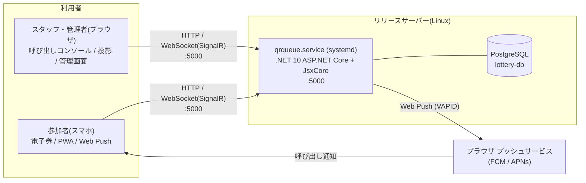
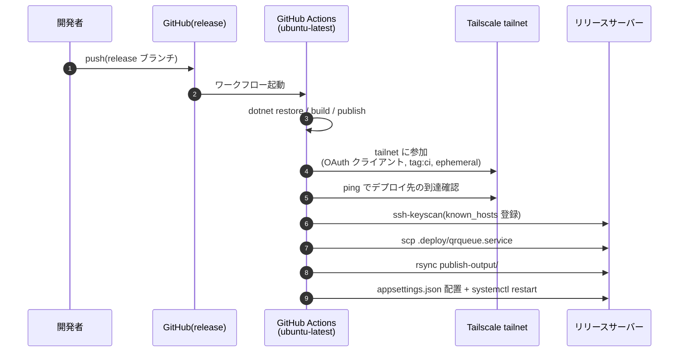
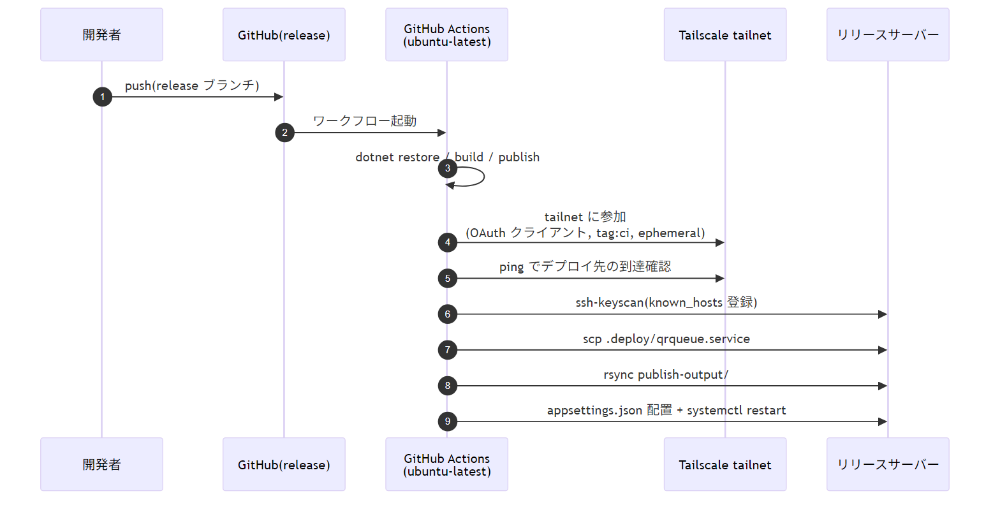
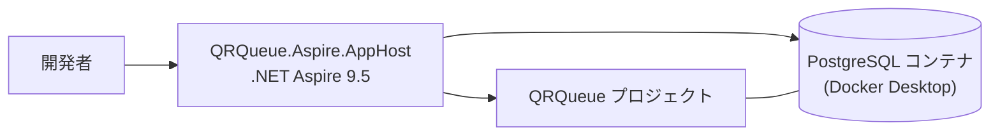
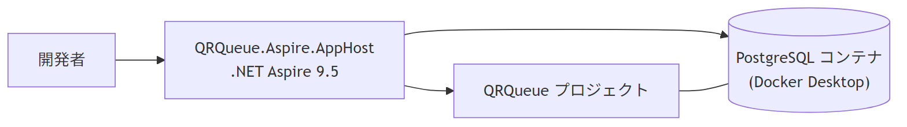

# インフラ構成

QRQueue のインフラ構成図(Mermaid)。デプロイ経路は PR #17 により Tailscale 経由の SSH。
各図の PNG は `images/` 配下に同梱(`mmdc -i <>.mmd -o <>.png -s 2 -b white` で再生成可能)。

## 全体構成

参加者・スタッフからのアクセスと、リリースサーバー上の構成。

- アプリは `ASPNETCORE_URLS=http://*:5000` で待ち受け(`.deploy/qrqueue.service`)
- DB 接続文字列は GitHub Secrets `APPSETTINGS_JSON` 経由で `appsettings.json` として配置
- PDF(QuestPDF)・QR生成はアプリ内で完結(外部サービスなし)

## デプロイフロー

`release` ブランチへの push を起点に、GitHub Actions が Tailscale 経由でSSHデプロイする。

- runner は `tag:ci` 付きの ephemeral ノードで、ワークフロー終了後に自動削除される
- 接続先 `DEPLOY_HOST` は MagicDNS 名または Tailscale IP(`100.x.x.x`)
- サーバーのSSHを公開インターネットに晒す必要がない

## 開発環境

ローカルでは .NET Aspire でアプリと PostgreSQL コンテナを起動する。

